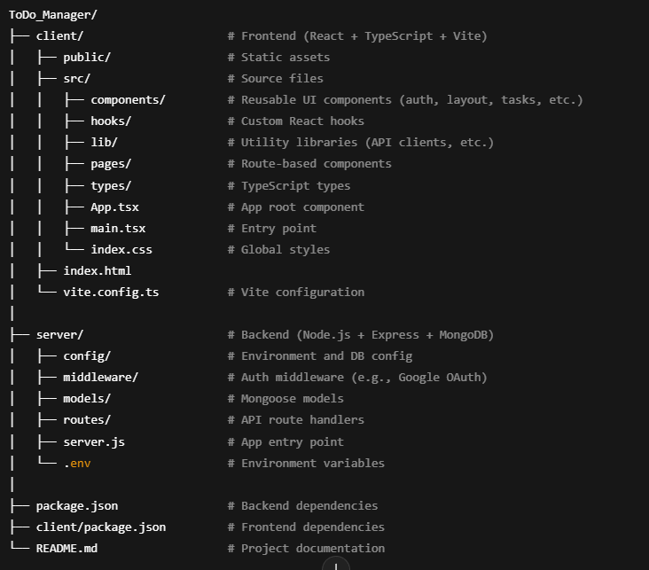

# ToDo_Manager

 
# 📝 TaskVerse - Google OAuth Todo Manager

**TaskVerse** is a full-stack Task Management Web Application that allows users to manage their daily tasks with ease. It features a secure **Google OAuth 2.0 authentication** system and a seamless task dashboard for creating, editing, and tracking todos.

---

## 🚀 Features

- ✅ **Google Login using OAuth 2.0**
- ✅ **Session or JWT-based token handling**
- ✅ **Protected Dashboard (`/tasks`)**
- ✅ Create, update, delete, and view tasks
- ✅ Token stored securely in `localStorage`
- ✅ Simple and clean UI with responsive layout
- ✅ Route protection (unauthenticated users redirected to login)
- ✅ Modular React components (Login, TaskList, etc.)
- ✅ Express backend with Google login strategy

---

📁 Project Structure

---

## 📽️ Demo

🎥 [Click here to watch the demo video](assets/ToDoManager.mp4).  link (https://todomanag.netlify.app/)  

---

## 🔐 Authentication Flow

1. User visits `/` and clicks **Sign in with Google**
2. They're redirected to:
3. After successful login, backend redirects to:
4. Frontend reads token, stores it in `localStorage`, then redirects to:
5. Dashboard loads, allowing full task management access.

---

## ⚙️ Tech Stack

| Frontend          | Backend               | Auth & Storage         |
|-------------------|------------------------|-------------------------|
| React             | Node.js + Express      | Google OAuth 2.0        |
| React Router DOM  | Passport.js            | express-session / JWT   |
| LocalStorage      | CORS, dotenv           |                         |

---

## 🛠️ Installation & Setup

### 1. Clone the Repo
### 2. Install Backend Dependencies
      cd server
      npm install
### 3. Configure .env in server/
      PORT=5000
      SESSION_SECRET=your-session-secret
      GOOGLE_CLIENT_ID=your-google-client-id
      GOOGLE_CLIENT_SECRET=your-google-client-secret
      GOOGLE_CALLBACK_URL=http://localhost:5000/api/auth/google/callback
### 4. Start Backend
      node server.js
### 5. Install Frontend Dependencies
      cd ../client
      npm install
### 6. Start Frontend
      npm start
---

💡 Future Enhancements
      
     Add MongoDB integration for persistent task storage
     Enable due dates and priority tagging
     Add dark mode
     Implement mobile responsive layout

---

### 🙋‍♀️ Author

**Deepshika P**  
[LinkedIn](https://www.linkedin.com/in/deepshika-p-2989b7262/)

